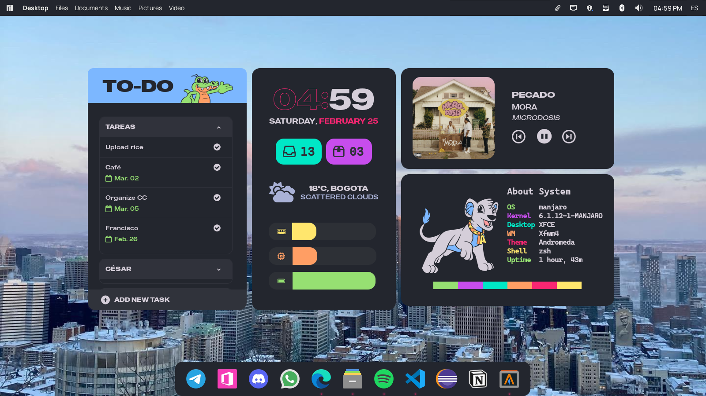
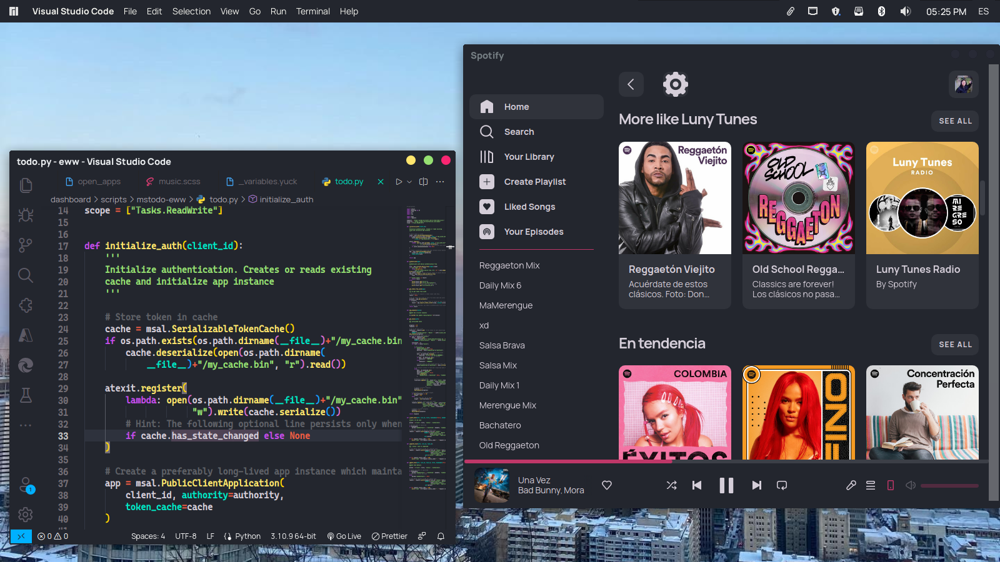
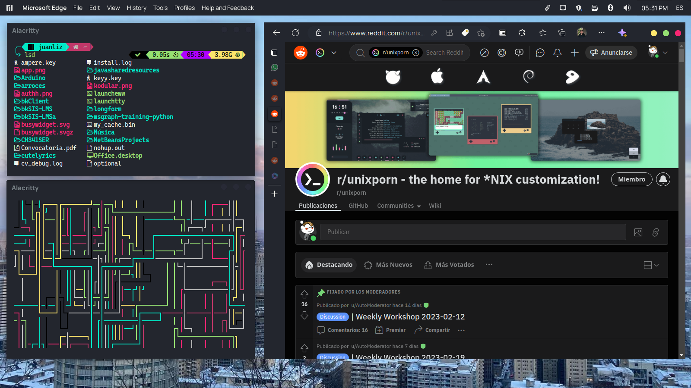

<div align="center">
    <h1>🍚️ Arroces 🍚️</h1>
</div>

This is my Linux dotfiles collection. Contains:

- Andromeda theme for GTK and Xfwm
- Eww widgets with Microsoft To Do integration
- zsh and alacritty configuration files




https://user-images.githubusercontent.com/47019693/221390886-c4040388-726a-49b4-843a-99b5f22710ef.mp4





<hr>

Currently using:

- **OS:** Manjaro Linux
- **WM:** Xfwm4
- **Terminal:** Alacritty
- **Browser:** Microsoft Edge
- **Text editor:** Visual Studio Code

## Setup

### Installation

Clone the repository:

```sh
git clone https://github.com/JuanLiz/arroces && cd arroces
```

Copy the files:

```sh
mkdir -p $HOME/.config/ && cp -r eww/. $HOME/
mkdir -p $HOME/.themes/ && cp -r theme/. $HOME/
cp -r alacritty/. $HOME/
cp -r zsh/. $HOME/
```

Install the fonts:

```sh
sudo cp -r fonts/. /usr/share/fonts/
```

Once finished, rebuild font cache:

```sh
fc-cache -fv
```

### To Do widget

In order to use the To Do widget, connection to Microsoft Graph needs to be configured.

1. Open [Azure Portal](https://portal.azure.com/#view/Microsoft_AAD_RegisteredApps/ApplicationsListBlade) and click `New registration`
2. Enter a name, choose account type `Accounts in any organizational directory (Any Azure AD directory - Multitenant) and personal Microsoft accounts (e.g. Skype, Xbox)`
3. Copy and keep the Application (client) ID under the app name for later use.
4. Under `Manage`, click Authentication.
5. Enable `Allow public client flows` and save.
6. Under `Manage`, click API Permissions and then, `Add a permission`
7. Click `Microsoft Graph > Delegated permissions`
8. Search "Tasks", then check `Tasks.ReadWrite` and `Tasks.ReadWrite.Shared`
9. Click `Add permissions`

At this point, application has been registered successfully.

Install To Do requirements:

```sh
pip install -r $HOME/.config/eww/dashboard/scripts/mstodo-eww/requirements.txt
```

### Setting environment variables

Create and open dotenv file:

```sh
nano $HOME/.config/eww/dashboard/scripts/.env
```

Paste the following text:

```plaintext
CLIENT_ID=your_id
EMAIL=your_email
PASSWORD=your_password
OWM_KEY=your_owm_key
OWM_CITY=your_city_id
```

Replace your_id with previously generated Application (client) ID.

For pending emails counter, you need to set your_email and your_password (generate app password if you use 2FA/MFA).

For weather, you need to set [OpenWeatherMap API key](https://openweathermap.org/api) (OWM_KEY) and [city id](http://bulk.openweathermap.org/sample/city.list.json.gz) (OWM_CITY)

After this, save and close.

> At this point, **widgets are ready and now you can execute eww**

## Credits

Andromeda theme is based on [Eliver Lara's theme for VSCode](https://github.com/EliverLara/Andromeda) and his [Dracula theme for GTK](https://github.com/dracula/gtk) was used as base to adapt Andromeda for GTK.

[rxyhn's tokyo](https://github.com/rxyhn/tokyo) widgets used as base for eww widgets.

Felicilandia's characters designed by [Milkman](https://www.instagram.com/milkman).

